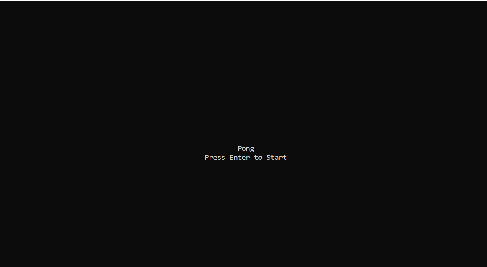
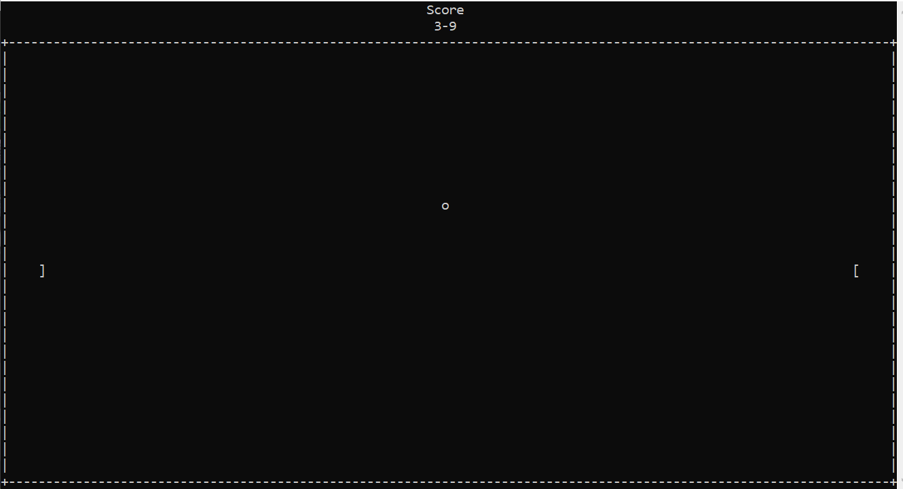
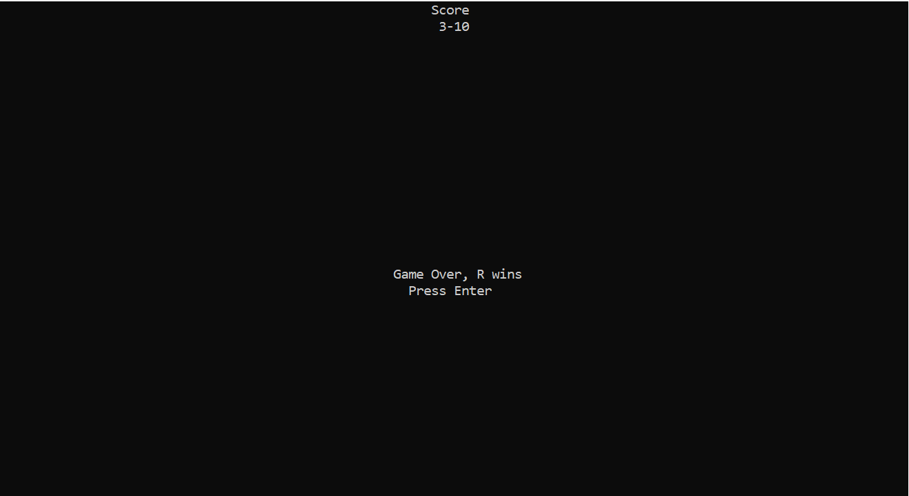

# Desciption 
This was a small project I wrote over the summer after learning C in first year. It's a recreation of Pong that uses the ncurses library to make some of the graphics in the terminal a little easier to work with, as well as for keyboard controls. '

# How to run
To be honest I mostly know how to make it work on Linux (Ubuntu specifically) and macOS. On windows you can also use WSL to run it. You'll need the ncurses library. On mac it should be preintsalled. On Linux you can install it through the terminal. 

To compile, run:

```
gcc Pong.c -lncurses
```

in the terminal. Then run 

```
./a.out
```

Or you can call it whatever you want and run that.

# The Game
The game starts with the following screen:



The game itself is pretty simple. Score on the top, with the paddles and ball within a rectangular border. 



When one will gets 11 points, the game ends and the players are greeted with the following screen



# This vs ECE243Pong

So, for our second your computer organization course we were allowed to make a project of our choosing. I chose Pong, because I wanted to attempt to write it with better coding habits and a few extra features. Plus, writing it to work directly with the I/O devices was very interesting. However, this one, despite being more limited, doesn't require the De1-SoC board and doesn't have its speed hampered due to simulations. Plus we aren't allowed to distribute our code due to academic integrity policies. However like I mention on that page, I'd be happy to discuss that project with anyone interested. 